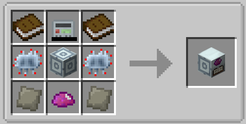

<p align="center"></p>

# UU Research

An addon for **IC2 Classic** (Minecraft 1.19.2, Forge): UU-Matter replication recipes have to be
**researched** before you can use them.

In IC2 Classic, UU-Matter recipes are secrets. You either have to look them up on a wiki or turn all
secrets on in the config. UU Research turns them into progression: build a research station, spend
UU-Matter and energy on an item, and its replication recipe unlocks for the whole world.

## How it works

1. Craft a **UU Research Station** (MV machine, 128 EU/t max input, 32 EU/t).
2. Click the target slot and pick an item from the list. The list shows only items that have a UU-Matter
   recipe and are not researched yet. You can also click the slot with the item in hand.
3. Put UU-Matter into the input. Like the Rare Earth Extractor, the machine processes it **one unit at a
   time**. The bar at the top shows processed / needed UU. Recipes that cost more than a stack, such as
   elytra (112 UU), just need to be topped up.
4. When enough UU has been processed, the machine outputs **one craft of the recipe** (1 diamond,
   16 cobblestone, ...) and the recipe is researched: it appears in JEI and works in the crafting table.

Research is shared by the **whole world** (all players), and the machine idles on a target that is
already researched.

Processed UU-Matter is lost if you change the target, if the item is researched somewhere else, or if
the machine is broken, just like in the Rare Earth Extractor.

## Features

- UU-Matter recipes are hidden in JEI and **cannot be crafted** until researched. The crafting grid tells
  you why a pattern gives nothing.
- Recipes panel in the machine window with every researched recipe.
- Item tooltips: `UU: researched ✓`, or with **Shift** the research cost and time.
- **Iridium ore** is researched like everything else. Emerald (diamond + UU) and shulker shell
  (shell + UU) are conversions rather than replication, so they stay regular IC2 secrets.
- IC2 upgrades: overclocker, transformer, energy storage, ejectors/pullers, muffler.
- Comparator output: research progress or "working".
- Operator commands (permission level 2):
  `/uuresearch learn <item>`, `forget <item>`, `learnall`, `reset`, `list`.

## Recipe



| | | |
|---|---|---|
| Book | OD Scanner | Book |
| Advanced Circuit | Advanced Machine Casing | Advanced Circuit |
| Advanced Alloy | UU-Matter | Advanced Alloy |

## Configuration

Server config `saves/<world>/serverconfig/uuresearch-server.toml`:

| Option | Default | Meaning |
|---|---|---|
| `euPerUU` | 10000 | EU per 1 UU of an item's replication cost (research time) |
| `defaultCostUU` | 1 | Cost for items IC2 has no UU cost for |
| `requireResearchToCraft` | true | Block crafting of UU recipes until researched |

## Requirements

- Minecraft 1.19.2, Forge 43+
- IC2 Classic **1.19.2-2.1.3.x**. The machine is built on IC2's own machine classes, so other IC2
  versions are not supported.
- JEI (optional, recommended)

## Building

```
./gradlew build
```

The jar ends up in `build/libs/`. The first build takes about 10 minutes while ForgeGradle
deobfuscates Minecraft.

## License

MIT, see [LICENSE](LICENSE).

---

## По-русски

Аддон для **IC2 Classic** 1.19.2: рецепты репликации из UU-материи нужно **изучить**, прежде чем ими
пользоваться. В UU-исследователе выбираешь цель, подаёшь UU-материю (перерабатывается по одной, как в
редкоземельном экстракторе) и энергию. Машина выдаёт первый крафт и открывает рецепт для всего мира: он
появляется в JEI и начинает крафтиться. Требуется IC2 Classic 1.19.2-2.1.3.x.
